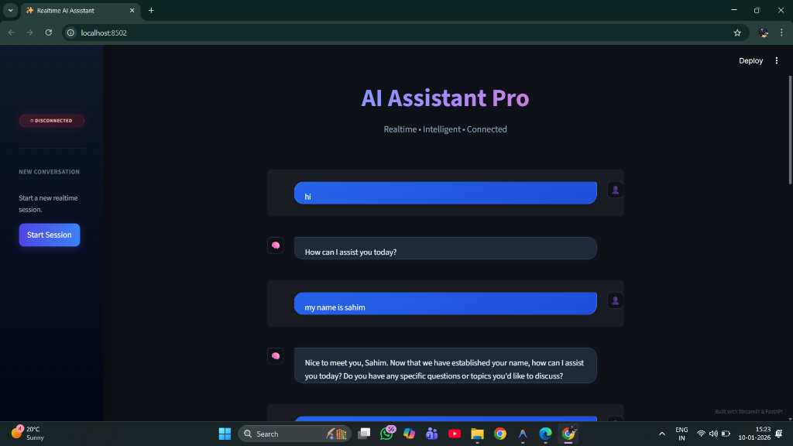

# 🧠 Realtime AI Assistant (FastAPI + Streamlit + Llama 3)

A full-stack, real-time AI chat application built with **FastAPI** (Backend) and **Streamlit** (Frontend). It features streaming responses, session-based conversational memory, and a high-end glassmorphic UI.



---

## 🚀 Key Features
*   **Real-Time Streaming**: Token-by-token LLM responses via WebSockets.
*   **Conversational Memory**: Remembers context from previous turns within the session (last 10 interactions).
*   **Session Management**: Create new sessions, persist chat history, and generate session summaries.
*   **Premium UI**: Custom CSS-styled Streamlit interface with glassmorphism, floating inputs, and animated bubbles.
*   **Scalable Backend**: Asynchronous architecture using FastAPI and Supabase.

---

## 🛠️ Technology Stack
*   **Backend**: Python, FastAPI, Uvicorn, WebSockets.
*   **AI Model**: Groq API (Llama 3.1 8B Instant).
*   **Database**: Supabase (PostgreSQL) - storing Sessions and Events.
*   **Frontend**: Streamlit, Custom CSS.

---

## 🗄️ Database Schema (Supabase)

This project requires a Supabase project. execute the following SQL in your Supabase **SQL Editor** to create the necessary tables.

### 1. Sessions Table
Stores metadata for each chat session.
```sql
CREATE TABLE public.sessions (
    session_id UUID PRIMARY KEY,
    user_id TEXT,
    start_time TIMESTAMP WITH TIME ZONE DEFAULT NOW(),
    end_time TIMESTAMP WITH TIME ZONE,
    summary TEXT
);
```

### 2. Events Table
Stores individual messages (user inputs and AI responses) linked to a session.
```sql
CREATE TABLE public.events (
    event_id UUID DEFAULT gen_random_uuid() PRIMARY KEY,
    session_id UUID REFERENCES public.sessions(session_id),
    type TEXT NOT NULL, -- 'user_message', 'ai_response', 'summary'
    timestamp TIMESTAMP WITH TIME ZONE DEFAULT NOW(),
    payload JSONB
);
```

---

## ⚙️ Setup Instructions

### 1. Clone & Environment
```bash
# Clone the repository
git clone <repository_url>
cd ai-backend

# Create a virtual environment
python -m venv venv

# Activate (Windows)
.\venv\Scripts\activate

# Activate (Mac/Linux)
source venv/bin/activate
```

### 2. Install Dependencies
```bash
pip install -r requirements.txt
```

### 3. Environment Variables
Create a `.env` file in the root directory:
```env
# Backend Settings
BACKEND_WS_URL=ws://localhost:8000/ws/session
BACKEND_HTTP_URL=http://localhost:8000

# API Keys
GROQ_API_KEY=your_groq_api_key_here
SUPABASE_URL=your_supabase_project_url
SUPABASE_KEY=your_supabase_anon_key
```

---

## ▶️ How to Run

You need to run the Backend and Frontend in separate terminals.

### Terminal 1: Backend (FastAPI)
Starts the WebSocket server on port `8000`.
```bash
python -m uvicorn main:app --reload
```
*   **Docs**: Visit `http://localhost:8000/docs` to test endpoints via Swagger UI.

### Terminal 2: Frontend (Streamlit)
Starts the Chat UI on port `8501`.
```bash
python -m streamlit run streamlit_app.py
```
*   **App**: Open `http://localhost:8501` (or the port shown in terminal).

---

## 🧩 Key Design Choices

### 1. **Why WebSockets?**
Standard HTTP requests are blocking. For an LLM that generates long text, waiting 5+ seconds for a full response is a bad UX.
*   **Choice**: We used `FastAPI WebSockets` to stream text token-by-token.
*   **Result**: The user sees the first word instantly (Speed of Thought), creating a feeling of "real-time" interaction.

### 2. **Conversational Memory Architecture**
LLMs are stateless by default. To satisfy the requirement for "Complex Interaction", we implemented a **Retrieval-based Memory**:
*   On every message, the backend queries Supabase for the last 10 events of the session.
*   It formats this history (`User: ... AI: ...`) and pre-pends it to the system prompt.
*   This allows the AI to answer context-dependent questions like "What is my name?" referring to previous turns.

### 3. **UI/UX Philosophy**
We moved beyond standard Streamlit widgets to create a SaaS-like experience.
*   **CSS Injection**: We used `st.markdown(unsafe_allow_html=True)` to override Streamlit's default padding, inputs, and fonts.
*   **State Management**: Streamlit reruns the script on every interaction. We used `st.session_state` combined with a **Thread-Safe Queue** to bridge the asynchronous WebSocket background thread with the synchronous Streamlit render loop.

---

## 🧪 Testing

1.  **Connect**: Open the Streamlit app.
2.  **Test Memory**:
    *   Say: *"My name is Alice"*
    *   Ask: *"What is my name?"* -> AI should reply *"Alice"*.
3.  **Test Streaming**: Ask a long question (e.g., *"Write a poem about coding"*). Observe the text appearing incrementally.
4.  **Session Loop**: Click "End Session" in the sidebar to generate a summary and start fresh.
